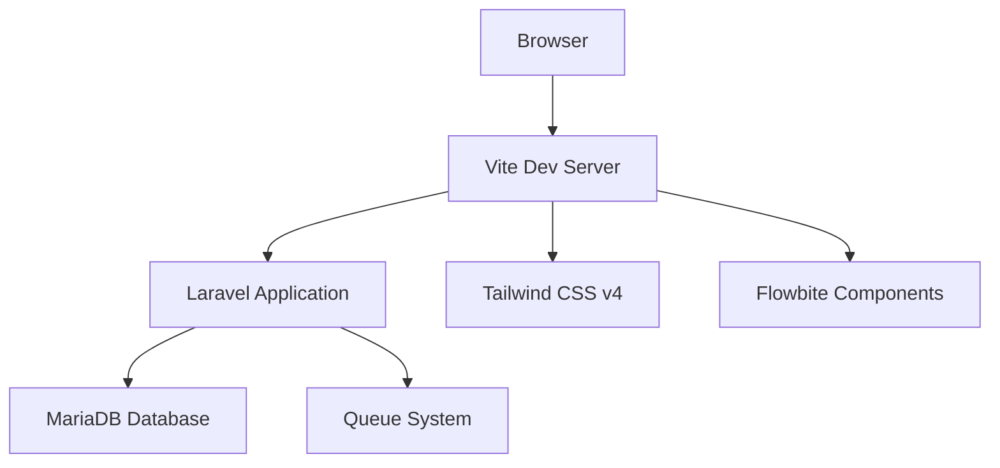

## What is Solare Admin View?

Solare Admin View is a clean, modern administrative interface built on Laravel 12, designed to provide a solid foundation for building administrative dashboards and management panels. It combines the power of Laravel's backend capabilities with a beautiful, responsive frontend powered by Tailwind CSS v4 and Flowbite components.

## Key Features

<CardGroup cols={2}>
  <Card title="Laravel 12 Framework" icon="php">
    Built on the latest Laravel 12 with PHP 8.2+ for modern, secure backend development
  </Card>
  <Card title="Tailwind CSS v4" icon="paintbrush">
    Utilizes the cutting-edge Tailwind CSS v4 with the new CSS-first configuration approach
  </Card>
  <Card title="Flowbite Components" icon="layer-group">
    Pre-integrated Flowbite UI components for alerts, modals, dropdowns, and more
  </Card>
  <Card title="Vite Asset Bundling" icon="bolt">
    Lightning-fast development with Vite for instant HMR and optimized production builds
  </Card>
</CardGroup>

## Tech Stack

Solare Admin View leverages modern web technologies to deliver a fast, maintainable, and scalable admin interface:

### Backend
- **Laravel 12**: The latest version of the popular PHP framework
- **PHP 8.2+**: Modern PHP features including typed properties and enums
- **MariaDB/MySQL**: Robust relational database support
- **Queue System**: Built-in job queue for background processing

### Frontend
- **Tailwind CSS v4**: The new CSS-first configuration using `@import` and `@source` directives
- **Flowbite**: Comprehensive UI component library built on Tailwind
- **Vite**: Next-generation frontend tooling for blazing fast builds
- **Instrument Sans Font**: Clean, professional typography from Google Fonts

### Development Tools
- **Laravel Pail**: Real-time log monitoring
- **Laravel Pint**: Opinionated PHP code style fixer
- **Pest PHP**: Elegant testing framework
- **Concurrently**: Run multiple dev servers simultaneously

## Architecture Overview



## Project Structure

The project follows Laravel's conventional structure with some key areas:

```bash
solare-admin-view/
├── app/
│   ├── Http/
│   │   └── Controllers/     # Application controllers
│   └── Models/              # Eloquent models
├── database/
│   ├── migrations/          # Database migrations
│   └── seeders/             # Database seeders
├── resources/
│   ├── css/
│   │   └── app.css         # Tailwind v4 configuration
│   ├── js/
│   │   ├── app.js          # Main JavaScript entry
│   │   └── bootstrap.js     # Bootstrap configuration
│   └── views/
│       └── loginScreen/     # Authentication views
├── routes/
│   └── web.php             # Web routes
└── vite.config.js          # Vite configuration
```

## Tailwind CSS v4 Integration

Solare Admin View uses Tailwind CSS v4's modern configuration approach. Instead of a traditional `tailwind.config.js` file, configuration is done directly in CSS:

```css resources/css/app.css
@import "tailwindcss";
@import "flowbite/src/themes/default";

@source "../../resources/views/**/*.blade.php";
@source "../../resources/js/**/*.js";
@source "../../vendor/laravel/framework/src/Illuminate/Pagination/resources/views/*.blade.php";

@plugin "flowbite/plugin";

@theme {
    --font-sans: 'Instrument Sans', ui-sans-serif, system-ui, sans-serif;
}
```

<Note>
The `@source` directives tell Tailwind where to scan for class usage, while `@theme` allows you to customize design tokens directly in CSS.
</Note>

## Database Configuration

The project is configured to use MariaDB by default, with the following key features:

- **User Authentication**: Complete user table with password reset functionality
- **Session Management**: Database-driven sessions for scalability
- **Cache System**: Database cache driver for improved performance
- **Job Queue**: Database queue for background job processing

## What's Next?

Ready to get started? Check out the [Quickstart Guide](/quickstart) to install and run Solare Admin View in minutes.

<CardGroup cols={2}>
  <Card title="Quickstart" icon="rocket" href="/quickstart">
    Get up and running in under 5 minutes
  </Card>
  <Card title="Laravel Documentation" icon="book" href="https://laravel.com/docs/12.x">
    Learn more about Laravel 12
  </Card>
  <Card title="Tailwind CSS v4" icon="palette" href="https://tailwindcss.com/blog/tailwindcss-v4">
    Explore Tailwind CSS v4 features
  </Card>
  <Card title="Flowbite Components" icon="cubes" href="https://flowbite.com">
    Browse available UI components
  </Card>
</CardGroup>